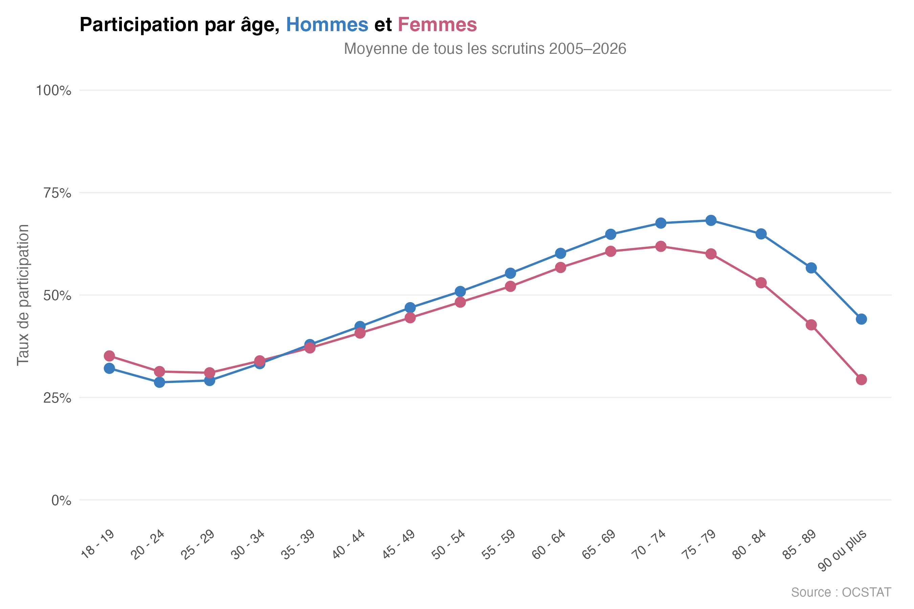
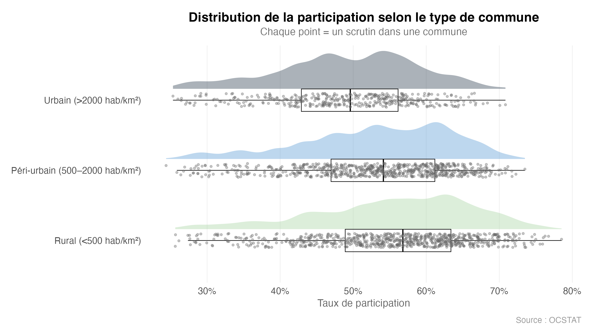

# Abstention à Genève
Qui vote, qui ne vote pas — et ce que ça change. Analyse des votations **genevoises** (2005–2026) à partir des données OCSTAT.

## En bref
-   14% de la population résidente a suffi à refuser la dernière initiative votée
-   Les jeunes et les citadins votent nettement moins que les seniors et les ruraux
-   L'écart ville/campagne se confirme sur l'ensemble des communes genevoises

## Figures
### Participation par âge, hommes et femmes

### Distribution de la participation selon le type de commune

## Contenu 
- [**Le code interactif (HTML)**](./analyse_electorale.html)
- [**Le code**](./analyse_electorale.Rmd)

## Source
OCSTAT, Canton de Genève
